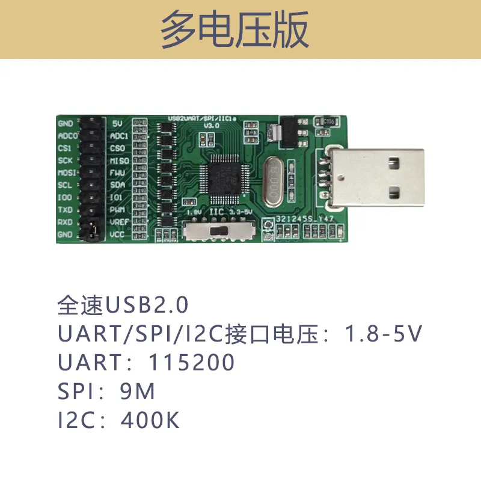
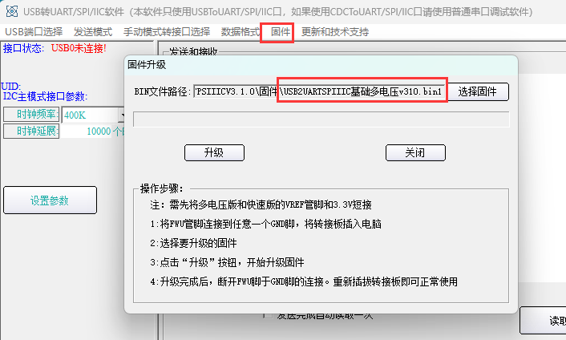
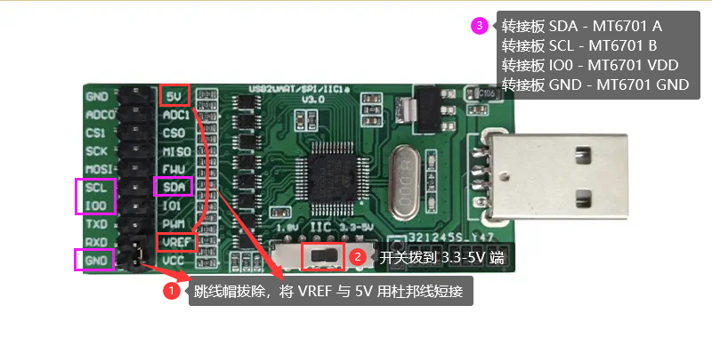
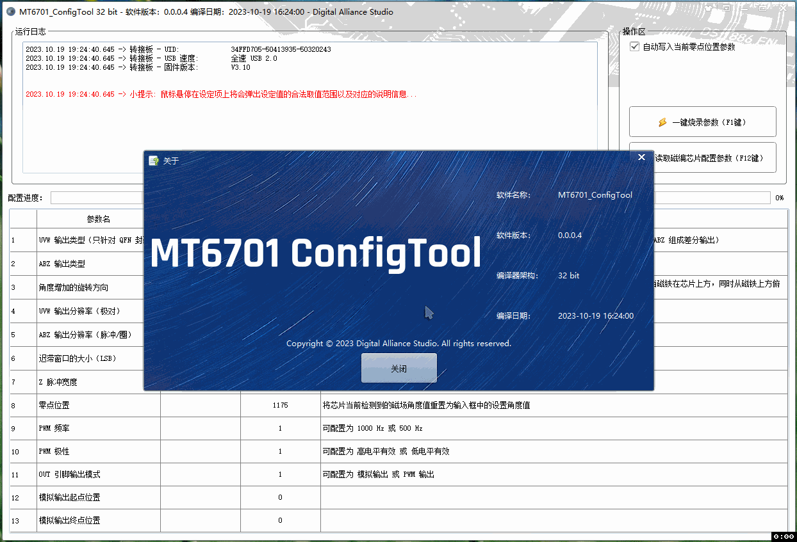
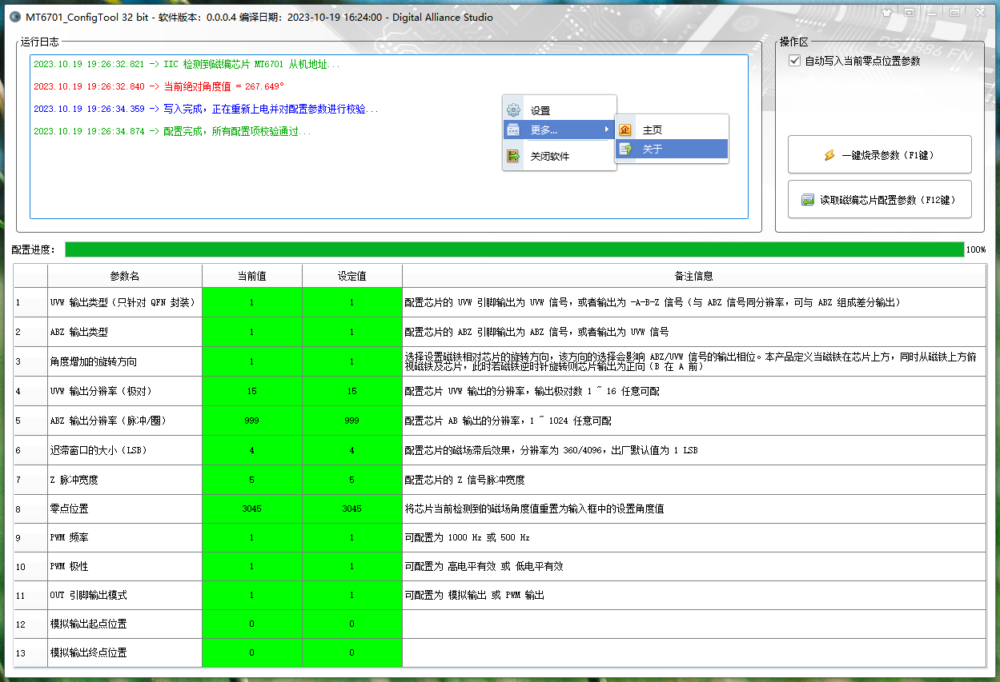
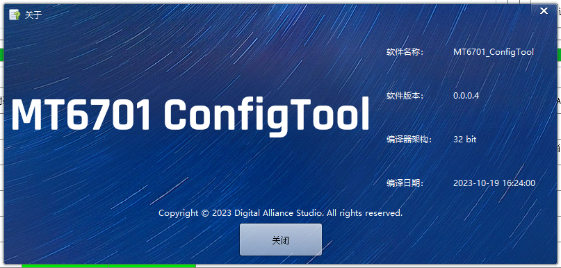

<table style = "width: 100%;">
<tr>
<td colspan="2" style = "text-align: center; font-size: 3em; font-weight: bold;">

:beers: MT6701_ConfigTool 

</td>
</tr>
<tr>
<td style = "width: 50%;">

## :book: 简介

本仓库用于 MT6701_ConfigTool 的发布，下载请跳转 [发布页面 (当前版本: v0.0.0.4)](https://github.com/DigitalAllianceStudio/MT6701_ConfigTool/releases)

本程序用于配置麦歌恩（MagnTek）高速磁性角度编码芯片 [MT6701](https://www.magntek.com.cn/list/174/554.htm)，虽然官方有相应的上位机配置软件和配套的硬件，但是使用体验较差，官方的上位机配置软件用起来较为卡顿，效率也不高，提示信息不完善，故自行开发了本配置软件。

</td>
<td style = "width: 50%;">

## :warning: 注意

:warning: 如果运行提示缺少 dll，请下载本仓库内的 :package: `MSVBCRT.AIO.2025.06.18.exe` 微软常用运行库并进行安装。

</td>
</tr>
<tr>
<td colspan="2" style = "text-align: center; font-size: 2em; font-weight: bold;">

:shopping_cart: 配套 USB2IIC 转接板硬件

</td>
</tr>
<tr>
<td style = "width: 80%;">

多电压版（1.8V ~ 5V）

</td>
<td style = "width: 20%;">

:warning: 本程序配套的硬件转接板请自行购买，购买链接：[USB 转 IIC 转接板 https://item.taobao.com/item.htm?id=562601046023](https://item.taobao.com/item.htm?id=562601046023)，转接板型号请选择 `多电压版（1.8V ~ 5V）`（因为 MT6701 的编程电压要求 VDD > 4.5V）。转接板驱动程序及资料请下载本仓库内的 :package: `USB2UARTPSIIICV3.1.2(20250226).zip` 并解压，之后安装转接板驱动。

</td>
</tr>
<tr>
<td style = "width: 80%;">

</td>
<td style = "width: 20%;">

:warning: 建议在安装驱动后，使用转接板资料包内的 `USB2UARTPSIIICV3.1.2\调试软件\通用调试软件\VCUSB2UARTPSIIIC.exe` 确认下转接板的固件版本，如果非最新版本，请根据下图示例更新一下转接板的固件，更新完毕后关闭 `VCUSB2UARTPSIIIC.exe`。

</td>
</tr>
</table>

<table style = "width: 100%;">
<tr>
<td colspan="2" style = "text-align: center; font-size: 2em; font-weight: bold;">

:link: 连接方法

</td>
</tr>
<tr>
<td style = "width: 80%; text-align: center; margin: 0 auto;">

</td>
<td style = "width: 20%; text-align: center; margin: 0 auto;">

|   | 转接板  | MT6701 |
|---|---------|--------|
| 1 | IO0     | VDD    |
| 2 | GND     | GND    |
| 3 | IIC SDA | A      |
| 4 | IIC SCL | B      |

|   | 转接板 | 转接板  |
|---|--------|---------|
| 1 | 5V    | VREF     |

</td>
</tr>
</table>

<table style = "width: 100%;">
<tr>
<td colspan="2" style = "text-align: center; font-size: 2em; font-weight: bold;">
软件截图

</td>
</tr>
</table>

----------

:star: Copyright © 2023 Digital Alliance Studio. All rights reserved.
